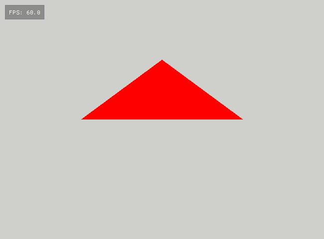

# Triangle

This is not an assignment. This is just a minimal setup to get you started. Once the project is built and executed, you
should see a red triangle on a light-gray background:

Before proceeding further please copy this folder to the `01_House` folder as described in the next
[House](../01_House/README.md) assignment.
