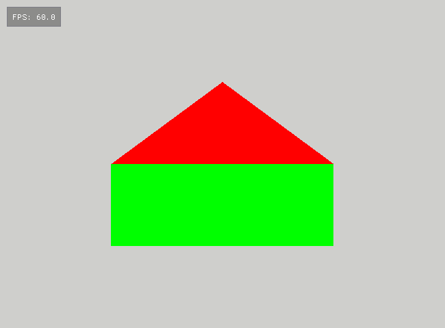

# Colors

#### 5 points

1. Start the assignment by copying the `01_House` assignment folder to `02_Colors` folder as described previously.

3. Now add the color data to the vertices. In the array holding the vertices, after coordinates of each vertex add a
   RGB blue color value (0,0,1). Please remember that in OpenGL the color channels take values from the interval [0,1].
   The data in vertex buffer should be arranged like this:
   ```
   x0,y0,z0,r0,g0,b0,x1,y1,z1,r1,g1,b1,x2,y2,z2,r2,g2,b2,...
   ```
3. After compiling and running the application, you will probably see something very strange or nothing at all. This
   happens because we have changed the format of the data in the vertex buffer. Please modify
   the `glVertexAttribPointer`
   function call to make it work again (this requires changing a single parameter). Remember that the `stride`
   and `offset` arguments of `glVertexAttribPointer` are given in bytes and that the `offset` argument has to be cast
   to `void*`.

4. If the house appears again on the screen, we can start connecting the colors from the vertex buffer.
   To this end please add an input variable (attribute) for colors in the vertex shader code with `location=1`.
   This should not change anything on the screen.

5. In the `app.cpp` file add appropriate `glVertexAttribPointer` and `glEnableVertexAttribArray` that will enable
   color to be read from the vertex buffer. Everything should still be working fine. Please take care when copying and
   pasting to appropriately change or remove the comments. Comments should always reflect the actual code. I suggest
   removing my comments as you are progressing with the assignments.

6. Finally, we have to pass colors from vertex shader to fragment shader.
   To this end add an _output_ variable 
   `vertex_color`  in
   the vertex shader and in the `main` function assign color attribute to it.
   Then add an input variable in fragment
   shader with **same type and name**.
   And finally, in the main function, of fragment shader assign this variable to the output of the
   fragment
   shader. You should see the house in blue color.

7. Play with colors to see how the colors are interpolated.

8. Color the roof of the house red (1,0,0) and the wall green (0,1,0) and submit the final version to the repository. 
   
   
   

