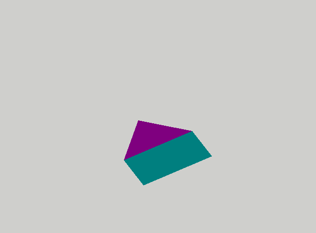

<style>
.center {
  display: block;
  margin: 1em auto;
  width: 50%;
}
</style>

# Uniforms

#### 8 points

In this assignment, you will learn how to add uniform interface blocks to shaders and connect them to buffers.

## Uniform interface block

### Modifying pixel color

The first uniform buffer will be used for modifying the color of the pixels, by mixing the original color with a color
passed via uniform interface block.

1. First, please add the following interface block to the fragment shader:
   ```glsl
    layout(std140, binding = 0) uniform Mixer {
    float strength;
    vec3  mix_color; 
   };
    ```  
   `mix_color` is the color that will be mixed with the original color of the pixel. `strength` is the strength of the
   mixing with one being the maximum and resulting in the mixing color, and zero in original color.

   The `binding=0` qualifier specifies the binding point of the interface block. This is a feature of OpenGL 4.2 and
   higher (sorry Apple ...), so accordingly you have to change first line of fragment shader to `#version 420`.
   The `std140` qualifier indicates how the block members will be lay out in the memory (more about that later and
   in [STD140](STD140.md) ).
   After running the program, nothing should change.


2. Next, you have to create a buffer that will back up this interface block. In the `init` method create a buffer and
   Then allocate `8*sizeof(float)` memory for this buffer without loading any
   data using the `glNamedBufferData` function.

3. Now load the data into the buffer. To this end, define two variables:
   ```c++
   float strength = 0.5;
   float mix_color[3] = {0.0, 0.0, 1.0};
   ```
   Load those variables into the buffer using `glNamedBufferSubData` function. Please respect the `std140` layout rules which
   can
   be found on page 138 of
   [OpenGL 4.5 (Core profile) specification](https://www.khronos.org/registry/OpenGL/specs/gl/glspec45.core.pdf). In
   this case, rules 1 and 3 apply. The floats are aligned to 4bytes (1 float) boundaries, but the float array of
   length 3 is aligned to 16 bytes (4 floats) boundary. So the data in the buffer should look like this:
   ```
   0.5 x x x  0.0 0.0 1.0 x
   ```
   where `x` denotes an "unused" space. If we had switched the order of the variables in the interface block, the
   data would look like this:
    ```
    0.0 0.0 1.0 0.5
    ```
   and fit into 16bytes (4 floats). I decided not to do this, just to show you how the `std140` layout works :)
4. 
4. Bind the buffer to interface block using `glBindBufferBase` function and the `GL_UNIFORM_BUFFER` target.
   Remember to
   bind the buffer between. 

5. Now use the variables from the interface block to modify the pixel color in the fragment shader. Use the  `mix`
   function. Modify
   only
   the RGB values and not the alpha. For that you can use _swizzling_ i.e. access the RGB values of the pixel
   color
   as `gl_FragColor.rgb` and similarly for all other color variables in fragment shader.

   The result should look like this:
   

### Moving houses :)

The second uniform interface block and uniform buffer will be used for moving the house,
by transforming the coordinates of the vertices in the vertex shader.
The parameters of this transformation will be passed to vertex shader via uniform interface block.

1. In vertex shader, please add interface block (remember to change the version to 420):
   ```glsl
   layout(std140, binding=1) uniform Transformations {
    vec2 scale;
    vec2 translation;
    mat2 rotation;
    };
   ```

2. In the `init` function create a new uniform buffer and allocate storage for it. According to `std140` layout `vec2`
   variables are aligned to 8 bytes (two floats) boundaries (rule 2). The 2x2 matrix `mat2` is treated as an array
   of two `vec2` variables  (rule 5). Each element of this array is aligned to a 16-byte boundary (rule 4). How
   many bytes do you have to allocate?
3. Create variables that will hold values to be loaded into the buffer:
   ```c++
   float theta = 1.0*glm::pi<float>()/6.0f;//30 degrees
   auto cs = std::cos(theta);
   auto ss = std::sin(theta);  
   glm::mat2 rot{cs,ss,-ss,cs};
   glm::vec2 trans{0.0,  -0.25};
   glm::vec2 scale{0.5, 0.5};
   ```
   As we use now `glm` for matrix and vector manipulation you have to include `glm/glm.hpp` and
   `glm/gtc/constants.hpp` files.

4. Load data into the uniform buffer,
   remember the `std140` layout rules. For `mat2` it means that each column of
   the matrix is aligned to a four floats boundary and the whole array is padded to a multiple of four floats as well.
   So a matrix
   ```
   a b
   c d
   ```
   Is stored as
   ```
   a c x x c d  
   ```
   where x denotes an "unused" space.
   You can access the column of a `glm` matrix by subscripting: `rot[0]` is the first column and `rot[1]` second.

5. Using `glBindBufferBase` function bind this buffer to uniform interface block in the shader. 

6. And finally, transform the vertices in the vertex shader:
   ```glsl 
   gl_Position.xy = rotation*(scale*a_vertex_position.xy)+translation;
   gl_Position.zw = a_vertex_position.zw;  
   ```
   It is best to add the transformations one by one. Start with translation, then scale and finally rotation. Are the
   parenthesis around  `scale*a_vertex_position.xy` really needed? Why?

   The final result should look like this:
   


