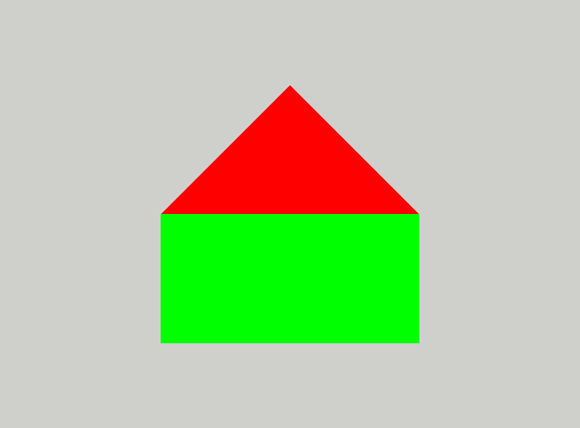
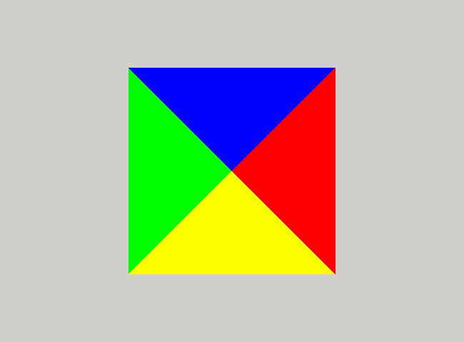

# Pyramid

#### 4 points

In this assignment, you will finally create a true 3D object.
You will also learn how to use the depth buffer and how to cull faces.

1. Start be removing the `Mixer` interface buffer and all the associated code both in shaders and c++ files.
   You will not need it anymore.

2. Next set the model transformation to unity and place the camera at (0,0,2) looking at (0,0,0) with up vector
   in the `y` direction. The result should look like this:

   

## Orientation and back-face culling

1. Before you create a pyramid, you have to understand the concept of _orientation_. Each triangle has a front and back
   face. Which is which depends on the order in which the vertices of the triangle were placed in the index buffer (or
   vertex buffer if the index buffer was not used). If looking at the triangle and enumerating the vertices in the order
   they have been placed in the index buffer we move in counterclockwise direction, we are looking at the front face. In
   the opposite case, we are looking at the back face. In general, all the triangles should have the same orientation.
   That is
   the front face of one triangle should be adjacent to the front face of the neighbouring triangle.

   This enables the use of so-called _back-face culling_. This is an optimisation technique that hinges on the fact that
   the back faces of models which form a closed surface are never visible. So any pixel belonging to a back face will be
   eventually overwritten by a pixel belonging to a front face. The OpenGL engine can detect back faces just after the
   vertex shader stage and discard them saving potentially thousands of expensive fragment shader calls.

   To enable back-face culling you have to issue the following command before drawing the object:
    ```c++
    glEnable(GL_CULL_FACE);
   ```
   Do this at the end of the `init` method.
   If the output remains the same, it means that all the faces are "face-up."
   If the house disappears completely, it means that all the faces are "face-down."
   If some triangles disappear, then
   the orientation triangles were not consistent.
   Before proceeding further fix this so that all triangles have the same orientation.

## The pyramid

1. Keeping in mind the above consideration, please create a pyramid.
   The pyramid base should be a square with side length equal to one laying in the (x,y,0) plane and centered at
   (0,0,0).
   The apex of the pyramid should be at (0,0,1). Each side
   and base of the pyramid should have different color:
   base: gray (0.5,0.5,0.5),
   +x facing side: red (1,0,0),
   -x facing side green (0,1,0),
   +y facing side: blue (0,0,1),
   -y facing side: yellow (1,1,0).
   Use the index buffer and the smallest possible number of vertices in vertex buffer.

   Remember to change the number of vertices in the `glDrawElements` call.

2. Switch on the depth buffer. This will enable the OpenGL engine to discard fragments that are behind other fragments.
   To do this issue the following command before drawing the object:

   ```c++
   glEnable(GL_DEPTH_TEST)
   ```

   Actually, you will probably not see any difference. That's because of the enabled face culling. The back faces are
   not
   drawn, so they will not obscure the front faces.
   Disable the face culling temporally and see the difference. You can do it by commenting out
   the `glEnable(GL_CULL_FACE)`
   command. You may have also to change the position of the camera to see any effect.

   Switch back to the original camera position as described at the beginning of this file.
   The correct result should look like this:

   

3. Before submitting, check if the base has proper orientation.
   You can do it by changing the z coordinate of the camera
   position to -2.
   That way, the camera will look at the base of the pyramid.
   If the base is not visible, it means that the orientation of the triangles is wrong.
   Fix it before submitting then change the camera position back to (0,0,2).


