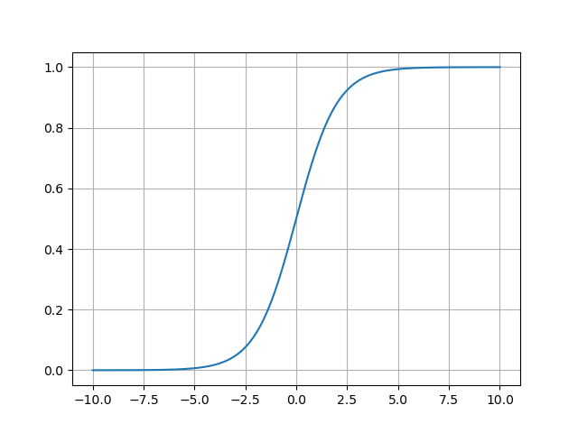
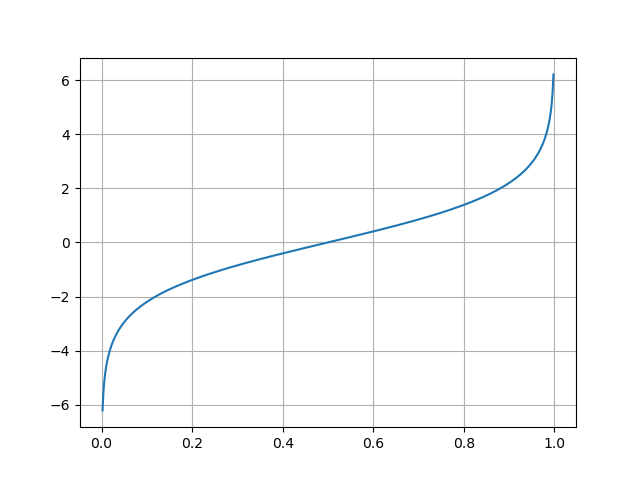

# Zoom

In this assignment, we will continue to add interactivity to our application. This time we will implement zooming
using the mouse wheel. Zooming will be implemented by changing the field of view of the camera.

## Preparation

1. However, before we do that, we will refactor our code by extracting the camera handling to a separate class. To this
   end create a new header file `camera.h` with the following content:

   ```c++
   #pragma once
   #include <cmath>
   #include "glm/glm.hpp"
   #include "glm/gtc/matrix_transform.hpp"
   
   class Camera {
   public:
   
     void look_at(const glm::vec3 &eye, const glm::vec3 &center, const glm::vec3 &up) {
         V_ = glm::lookAt(eye, center, up);
     }
   
     void perspective(float fov, float aspect, float near, float far) {
         fov_ = fov;
         aspect_ = aspect;
         near_ = near;
         far_ = far;
     }
   
     void set_aspect(float aspect) {
         aspect_ = aspect;
     }
   
     glm::mat4 view() const { return V_; }
   
     glm::mat4 projection() const { return glm::perspective(fov_, aspect_, near_, far_); }
     
   private:
     float fov_;
     float aspect_;
     float near_;
     float far_;
   
     glm::mat4 V_;
   };
   ```

2. In the file `app.h` in the `SimpleShapeAplication` class add a field:
   ```c++
   Camera *camera_;
   ```
   and two methods

    ```c++
    void set_camera(Camera *camera) { camera_ = camera; }
   
    Camera *camera() const {
        assert(camera_);
        return camera_;
    }
   ```
   Initialize the `camera_` field to `nullptr` in the constructor by adding it to the initializers' list:
   ```c++
    SimpleShapeApplication(int width, int height, std::string title, bool debug) :
    Application(width, height, title, debug), camera_(nullptr) {}
    ```

3. Next we modify our code to use the `Camera` class:

   In the `init` method initialize the camera pointer:
   ```c++
   set_camera(new Camera);
   ```

   In the `init` method use the  `Camera::look_at` method to set the camera position, and `Camera::perspective` to set
   the projection matrix. The parameters of those methods are the same as the parameters of the `glm::lookAt` and
   `glm::perspective` functions. To access those methods via the pointer returned by the `camera` method use the
   `->` operator.

    ```c++
    camera()->look_at(glm::vec3(2.0f, 1.0f, 2.0f), glm::vec3(0.0f, 0.0f, 0.0f), glm::vec3(0.0f, 0.0f, 1.0f));
    ```

   In the `framebuffer_resize_callback` method use the `Camera::set_aspect` method to set the aspect ratio of the
   camera.
   In the `frame` method use the methods `Camera::view` and `Camera::projection` for V and P matrices respectively.

4. Finally, remove unnecessary fields

   ```c++
   float fov_;
   float aspect_;
   float near_;
   float far_;

   glm::mat4 P_;
   glm::mat4 V_;
   ```
   from the `SimpleShapeApplication` class.

## Zooming

Zooming will be implemented by changing the field of view of the camera.
Zooming in will decrease the field of view, and zooming out will increase it.
However, we need to remember that the field of view is limited to the range (0, pi) in radians or (0 to 180) in degrees.

1. To smoothly transition from one end of the range to the other, we will use the logistic function:
   
   ```c++
   float logistic(float y) {
       return 1.0f/(1.0f+std::exp(-y));
   }
   ```

   and its inverse, also called `logit` function:
   
   ```c++   
   float logit(float x) {
       return std::log(x/(1.0f-x)); 
   }
   ```
   Please put those functions on top, but after the includes, of the   `camera.h` file in an anonymous namespace :

   ```c++
   namespace {
       float logistic(float y) {
         ...
       }
   
       float logit(float x) {
          ...
       }
   }
   ```   

2. The idea is to take the current field of view scale it to the range (0,1) and then transform it into range
   (-Inf, Inf) using the logit function.
   Then we add the offset received by rotating the mouse wheel and transform it back to the range (0,1) using the
   logistic function and finally rescale it to the range (0, pi):

   ```c++ 
   auto x = fov/glm::pi<float>();
   auto y = logit(x);
   y+= y_offset;
   x = logistic(y);
   fov = x*glm::pi<float>();
   ```

   The figure below illustrates how field of view changes with the offset for few selected values of the initial field
   of view.
   
   As you can see fov changes rather quickly around initial fov
   and then goes smoothly either to zero or 180 degrees.

   Implement this in the `zoom` method of the `Camera` class

   ```c++
   void zoom(float y_offset) {
    ... 
   }
   ```

   that takes the offset as a parameter and modifies the field of view `fov_` accordingly.

3. Finally, override the `scroll_callback` method in the `SimpleShapeApplication` class, so it calls the `zoom`
   method of the camera:

    ```c++
    void SimpleShapeApplication::scroll_callback(double xoffset, double yoffset) override {
    Application::scroll_callback(xoffset, yoffset);   
    camera()->zoom(yoffset / 20.0f);
    }
    ```

   The constant `20.0f` was chosen experimentally.
   Put this definition in the `app.cpp` file, and remember to add the declaration of this method with the `override`
   keyword in the class definition in the `app.h` file, like we did with the `framebuffer_resize_callback`.  


   