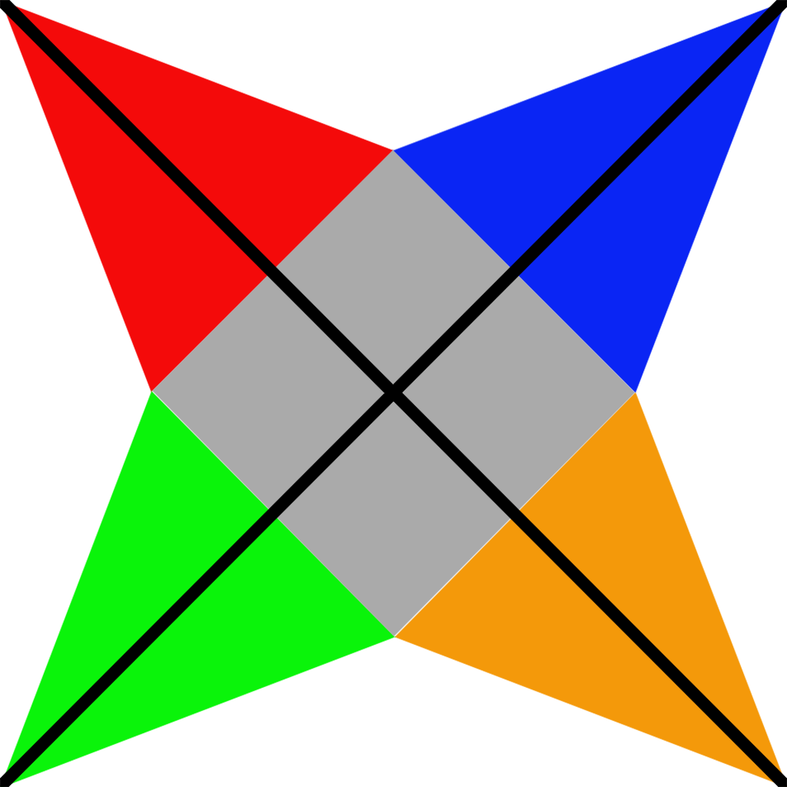

# Textures

In the previous assignment we have implemented a simple material class `KdMaterial` that allows us to set the color of
the object. In this assignment, we will go one step further and add the possibility for this color to be taken from
texture. In this way we will be able to modify the color at the pixel, rather than at the vertex level. You will do it
by modifying the `KdMaterial` class and shaders. We will keep the names because we are still only modifying the diffuse
reflection coefficient of the object.

## Texture coordinates

To add a texture to the object, we need to know the texture coordinates for each vertex. The texture coordinates (UV
map) for the pyramid are provided in the file [uv.png](uv.png):

Those coordinates are not really very visible on this scale, but you can read them when you enlarge the image.

As stated before, the vertices are considered equal if they have all attributes equal. This means that two vertices with
different texture coordinates are considered different. So if not for the vertex color attribute, we would have eight
different vertices in the pyramid.

1. So go ahead and remove the vertex color attribute from the vertex buffer. Remember to
   change the arguments of the mesh constructor.

2. Remove the vertices from the vertex buffer so only eight vertices with different texture coordinates remain. Modify
   the index buffer accordingly. Remember to respect the orientation of the triangles.
3. Add the texture coordinates to the vertex buffer. Remember to change the arguments of the mesh constructor and add
   corresponding `add_argument` call. Use `AttributeType::TEXCOORD_0` attribute. Make sure that everything works.

4. In vertex shader, add the corresponding input vertex attribute with location defined by
   the `AttributeType::TEXCOORD_0`. Define the corresponding output variable and assign the vertex attribute to it.

5. In fragment shader, add the corresponding input variable. Use this variable to set the RG colors of the fragment.
   This will enable you to check if the texture coordinates are send correctly to the vertex shader. If everything is OK
   revert to the original color setting code.

## Texture

We will use the texture from the file `multicolor.png` which can be found in the `Models` directory. 



To use the texture, we need to load it and send it to the shader.
For loading and image will use the `stb_image` library.
The library is already included in the project.
To use it please include the `stb/stb_image.h` header file. The image can then be loaded with the `stbi_load` function.


2. In the `init` method of the `SimpleShapeApplication` class load the image using the following code

   ```c++
   stbi_set_flip_vertically_on_load(true);
   GLint width, height, channels;
   auto texture_file = std::string(ROOT_DIR) + "/Models/multicolor.png";
   auto img = stbi_load(texture_file.c_str(), &width, &height, &channels, 0);
   if (!img) {
    std::cerr<<"Could not read image from file `"<<texture_file<<"'\n";
   } else {
    std::cout<<"Loaded a "<<width<<"x"<<height<<" texture with "<<channels<<" channels\n";
   }
   ```
   If everything is correct, you should see the info message.

3. Create the texture using the `glGenTexture` function, then bind it using `glBindTexture`  and load the image using `glTexImage2D` function. Set the
   interpolation (filtering) methods that do not use mipmapping using the `glTexParameteri` function.

Now we have to modify the fragment shader to enable it to read the shader from texture. That requires a _sampler_ which
is defined as a uniform variable

```glsl
uniform sampler2D map_Kd; 
```

1. Please add this line to the fragment shader. This is a uniform variable, not interface block. To assign a value to
   it,
   we must fist get its location using the `glGetUniformLocation` function. Add a static field `map_Kd_location_` of  
   type `GLint` to the `KdMaterial` class and set its' value in the `KdMaterial::init` function
   ```c++
   map_Kd_location = glGetUniformLocation(program(),"map_Kd");
   if (map_Kd_location_ == -1) {
            SPDLOG_WARN("Cannot find map_Kd uniform");
        }
   ```
2. Similarly, as with vertex colors, we have to somehow transmit to the fragment shader the information that the texture
   will be bound to the sampler, and we want to use it. We will do it using the material uniform buffer. Please add the
   ```glsl
   bool use_map_Kd; 
   ```
   field to the `Material` interface block in fragment shader. The in the `bind` method of the `KdMaterial` class load
   zero into this field. The bool variable in an interface block takes as much space as int or float.

3. In the fragment shader add code that depending on the value of the `use_map_Kd` variable multiply the color
   calculated so far using `Kd`, and vertex colors if present, by the value obtained from the sampler:
   ```glsl
   vec4 texture_color = texture(map_Kd, vertex_texcoord_0); 
   ```
   In this example `vertex_texcoord_0` are the vertex texture coordinates.
   Because the value of the `use_map_Kd` variable is set to zero (`false`), you should not see any difference.

4. Now we have to connect the sampler to the created texture. In the `KdMaterial` class add the field `texture_`
   of type GLuint. The `texture_` field will contain the handle to the texture that we have
   just created.

6. In the existing constructor set this field to zero. Then add a new three parameter constructor that sets this field.

7. In the `bind` method add the code that checks if the `texture_` field is greater than zero. If so please load the one
   into the `use_map_Kd` field of the material uniform buffer. The set the active texture unit to zero using
   the `glActiveTexture` function and bind  `texture_` using the `glBindTexture` function. 
   
   If `texture_` is equal to zero then just load zero into `use_map_Kd` field of the material uniform buffer.

   In the `unbind` method check if
   the value of the `texture_` field is greater than zero and if so unbind the texture.

8. In the `init` method of the `SimpelShapeApplication` add a single primitive encompassing all the indices and add a
   material with texture. Set the `Kd` to white.
   ```c++
   pyramid->add_primitive(0, 18, new xe::KdMaterial({1.f, 1.f, 1.0f, 1.0f}, false, tex_handle));
   ```

## Gamma correction

The texture that we have loaded is (probably) in the sRGB color space. This means that the color values are not linear.
At this moment, this is not a problem because we are not doing any calculations on the color. We are just sending it to
the screen where they are expected to be in SRGB color space.

1. But if we want to do any calculations on the color, we have to convert it to the linear color space. This can be done
   automatically by OpenGL, by changing the internal format in the `glTexImage2D` call to `GL_SRGB`. Please do it and
   notice that the colors have changed. This is because we are sending the linear values to the screen without any gamma
   correction.

2. We will add gamma correction directly in the shader. In fragment shader please add the function definition
   ```glsl
   vec3 srgb_gamma_correction(vec3 color) {
      color = clamp(color, 0.0, 1.0);
      color = mix(color * 12.92, (1.055 * pow(color, vec3(1.0 / 2.4))) - 0.055, step(0.0031308, color));
      return color;
   }
   ```
   and then modify the code that calculates the color of the fragment to
   ```glsl
   vFragColor.a = color.a;
   vFragColor.rgb = srgb_gamma_correction(color.rgb);
   ```   
   with `color` being the final color calculated in the shader. The colors should  change back to the original ones.


