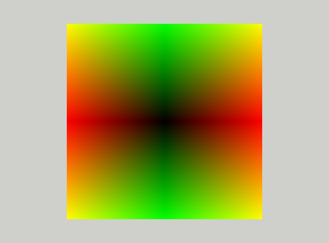

# Diffuse lightning

In this assignment we fill start to light up the models :) We will begin with the diffuse lightning.

## Square

1. It will be easier to debug the lightning if we have a simpler model. Based on the `pyramid.obj` and `pyramid.mtl`
   create two new files `square.obj` and `square.mtl` that will define square with `Kd` coefficient set to _silver sand_
   color
   (0.7490, 0.7569, 0.7601). Please disable the front face culling, as the square is not a closed object. Square should lay in th x-y planne and be centered at the origin and have size 2x2.
2. Set the camera in position (0, 0, 3) with fov 45 degrees and look down at the origin. Set the up vector to (0, 1, 0).
   You should see something like this:
   

# Blinn-Phong material

We will use the Blinn-Phong lightning model given by the equation:

In this assignment we will only use the first two terms of the equation, the ambient and diffuse lightning.

1. Start by copying the files `KdMaterial.h` and `KdMaterial.cpp` to `BlinnPhongMaterial.h` and `BlinnPhongMaterial.cpp`
   respectively.
   Change each occurence of `KdMaterial` to `BlinnPhongMaterial` in the new files. In the `SimpleShapeApplication::init`
   method add
   ```c++
   xe::BlinnPhongMaterial::init()
   ```
   at the beginning of the method.
   In the file `square.mtl` change the `illum=0` to `illum=1` and add the `Ka` coefficient with same value as `Kd`.

   The `Kd` coefficient corresponds to the `c_diff` variable in the lightning equation and
   the `Ka` coefficient corresponds to the `c_ambient` variable.

   Everything should work as previously.

2. Copy the `Kd_vs.glsl` and `Kd_fs.glsl` shader files to `BlinnPhong_vs.glsl` and `BlinnPhong_fs.glsl` respectively. In
   the `BlinnPhongMaterial::init` method change the shader names to the new ones.

3. Add `Ka_` field of `glm::vec4` in `BlinnPhongMaterial` class.
4. In the `create_from_mtl` method of this class assign `mat.ambient` to this field.
5. In the `init` method of this class register this factory method:
   ```c++
   xe::add_mat_function("BlinnPhongMaterial", BlinnPhongMaterial::create_from_mtl);
   ```
   
6. In the `Material` interface block in the `BlinnPhong` fragment shader add a `vec4 Ka` field at the beginning of the
   block.
   Modify the block size and loading accordingly.

   Everything should work as previously.

Now we have a base to start implementing the diffuse lightning.

## Normal vectors

As I hope you remember for lightning, we need to know normal vectors of the surface. In this case, it is particularly
simple as a square is flat. The normal vector is the same for all vertices, and it is perpendicular to the surface.

1. Add the normal vector in the `square.mtl` file:
   ```mtl
   vn 0.0 0.0 1.0
   ```
   and the index of this normal vector to every vertex in the face definitions:
   ```mtl
   f 1//1 2//1 3//1
   ```
   We add the index after two slashes `//` to indicate that we do not have texture coordinates.
   Nothing should change.

2. In `BlinnPhong_vs.glsl` vertex shader file please add the `a_vertex_normal` attribute of type `vec3`
   with `location=1`. Pass this attribute to the fragment shader with the name `vertex_normal_vs`. The `vs` suffix
   stands for "view space," as those are the coordinates that we will use for the lightning calculations.

3. Interpolating vectors can destroy their normalization, so we have to normalize the normal vector again in the
   fragment
   shader. In the `main` function add:
   ```glsl
   vec3 normal = normalize(vertex_normal_vs);  
   ```
4. Use the `normal` variable to set the color of the fragment in the fragment shader. You should see a blue square. The
   color should not change when you rotate the camera.

## Vertex positions

We will also need the vertex positions in the fragment shader. We already have this attribute in the vertex shader, but
we must pass it to the fragment shader.

1. Please do this using the variable `vertex_position_vs` of type `vec3` to which you will assign the `xyz` components
   of the `a_vertex_position` attribute.
2. In the fragment shader assign the absolute value of this variable to the `rgb` components of the pixel color.
   ```glsl
   vFragColor.rgb = abs(vertex_position_vs);
   ```
   You should see something like this:
   
   The color should not change when you rotate the camera.

## Transformations to the view space

The next step is to transform the vertex positions and normal vectors to view space.

### Positions

1. We will start with positions. Positions are transformed using the `V*M`  so please add this matrix to
   the `Transformations` interface block in the vertex shader
   ```glsl
   mat4 VM; 
   ```
   below the `PVM` matrix.

2. In the `init` method of the `SimpleShapeApplication` allocate enough space for the additional `VM` matrix.

3. In the `SimpleShapeApplication::frame` method set the  `VM` matrix to identity and pass it to the shader.

4. In the vertex shader multiply `a_vertex_position` by the `VM` matrix and assign the result to the
   `vertex_position_vs` variable.
   ```glsl
   vec4 a_vertex_position_vs = VM * a_vertex_position;
   vertex_position_vs = a_vertex_position_vs.xyz/a_vertex_position_vs.w;
   ```
   You should get the same picture as before

5. In the `SimpleShapeApplication::frame` method compute the `VM` matrix and pass it to the shader. Now the color
   pattern should change when you rotate the camera.

### Normals

The normal vector is a direction vector, so it is transformed using a 3x3  `VM_normal` matrix defined as follows:

```c++
auto R = glm::mat3(VM);
auto VM_Normal = glm::mat3(glm::cross(R[1], R[2]), glm::cross(R[2], R[0]), glm::cross(R[0], R[1]));
```

The transformed normal vector must be normalized again after the transformation.

1. Add the `N` matrix to the `Transformations` interface block in the vertex shader
   ```glsl
   mat3 VM_Normal; 
   ```
   below the `VM` matrix.
2. In the `init` method of the `SimpleShapeApplication` allocate enough space for the additional `N` matrix. Remember
   that because of
   the std140 layout a 3x3 matrix is stored as a 4x3 matrix.

3. In the `SimpleShapeApplication::frame` method compute the `N` matrix and pass it to the shader. The std140 layout
   mandates that a 3x3 three matrix is stored as three columns, each column aligned to the `4*sizeof(float)` boundary.
   So matrix
   ```text
      VM_normal = [
      00 01 02
      10 11 12
      20 21 22]
   ```
   is stored as
   ```text
   [00 10 20 _ 01 11 21 _ 02 12 22]
   ```
   with `_` denoting the "empty" space of size `sizeof(float)`. To get a pointer to column `k` use `&VM_normal[K]`.

4. In the vertex shader multiply `a_vertex_normal` by the `N` matrix and assign the result to the
   `vertex_normal_vs` variable.
   ```glsl
   vertex_normal_vs = normalize(VM_normal * a_vertex_normal);
   ```

5. In the fragment shader assign the `abs(vertex_normal_vs)` to the `rgb` components of the pixel color. You should see
   a blue square again.

6. In the `SimpleShapeApplication::frame` method compute the `N` matrix and pass it to the shader. Now the color of the
   square should change when you rotate the camera.

7. Assign again the proper colors to the `vFragColor` variable in the fragment shader.

## Lights

### Ambient

We will start with the ambient light. The ambient light is a constant light that is added to the scene regardless of the
position of the light source. It's a "poor man's" implementation of global illumination and represents the light that is
reflected from other objects in the scene.

1. In the `BlinnPhong_fs.glsl` fragment shader add a uniform interface block containing just the ambient light value:
   ```glsl
   layout (std140, binding = 2) uniform Lights {
     vec3 ambient;
   }
   ```   
2. In the `SimpleShapeApplication` class add field
   ```c++
   GLuint u_light_buffer_handle_;
   ```   
3. In the `init` method of this class add the code that creates a uniform buffer and initializes this field.
4. In the `frame` method load value (0.25, 025, 0.25) into `ambient` field of this buffer.

5. In the fragment shader assign product of `Ka` and `ambient` to `vFragColor`. You should see a dark, but not black,
   square.

### Point light source

The point light source is the simplest light source. It is defined by its position, color, intensity and radius. In
the `Engine` directory you will find the `light.h` header file with the definition of class `PointLight`. The `alignas`
qualifiers make sure that this class conforms to `std140` and can be directly copied to light uniform buffer.

1. Please add the corresponding structure in the fragment shader
   ```glsl
   struct PointLight {
     vec3 position;
     float radius;
     vec3 color;
     float intensity;
    };
   ````
2. Then change to `Lights` uniform interface block to
   ```glsl
   const int MAX_POINT_LIGHTS = 16;
   
   layout (std140, binding = 2) uniform Lights {
     vec3 ambient;
     int n_lights;
     PointLight lights[MAX_POINT_LIGHTS];
   };
   ```
3. Add a field
   ```c++
   std::vector<xe::PointLight> lights_;
   ```
   in the `SimpleShapeApplication` class and corresponding
   ```c++
   void add_light(xe::PointLight light) { lights_.push_back(light); }
   ```
   method.
4. Modify the size of the `Lights` uniform buffer accordingly. The maximum number of lights is defined in `light.h`
   ```c++
   const GLuint MAX_POINT_LIGHTS = 16;
   ```

5. Add a white light at position `(0,0,1)` with intesnisty `1.0` and radius `0.1`.

6. In the `frame` method load the number of lights (the size of the `lights_` vector) in to the lights uniform buffer.

7. In the `frame` method add a loop that will load each light from the `lights_` vector to the lights uniform buffer.
   Before loading the light transform it from world space to the view space using the `transform` function
   provided in the `light.h` file. 

8. In the fragment shader use add the light from each light to the fragment color using the diffuse part of the formula
   presented above. Remember 1/pi factor.
   ```glsl
   FragColor.rgb += INV_PI * color.rgb * lights[i].color * lights[i].intensity *diffuse;
   ```
9. Add light attenuation according to the formula
   ```glsl
   float r = max(lights[i].radius, light_distance);
   float attenuation = 1.0 / (r * r);
   ```
   where `light_distance` is the distance from the light to the fragment.

## Back faces

When turning the camera, you will notice that the back face of the square is also lit. This is because the normal vector
is the same as for the front face. We can fix this by using the `gl_FrontFacing` variable that is set to `true` if the
fragment belongs to the front face and `false` otherwise. We can use this variable to flip the normal vector if the
fragment belongs to the back face. In the fragment shader, please add the following code:

```glsl
if (!gl_FrontFacing) {
  normal = -normal;
}
```

Now you the backface should be dark.
   
