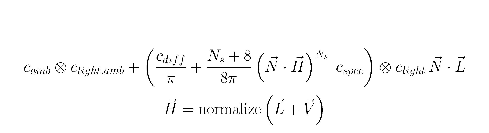

# Specular

In this assignment, you will add a specular component to the fragment shader. In addition to what was needed to
calculate the diffused lightning, you will need also _view vector_: this is a normalized vector from fragment to the
observer. This is very easy to calculate as the position of the observer (camera) is the origin of the coordinate
system (0,0,0).

1. Calculate the view vector in fragment shader.

2. Using light vector and view vector, calculate the half-vector.

3. Calculate the specular component of the Phong model acording to the formula:

    

   You will need the `Ks` and `Ns` parameters. `Ks` corresponds to c_spec in the formula and represents the
   specular color of the surface. `Ns` governs the _shininess_ of the surface. For now, set them to white (1.0,1.0,1.0)
   and 500.0 respectively "by hand" in the fragment shader.

4. Add the specular component to the fragment color in the fragment shader.

5. Add fields for `Ks` and `Ns` in the `BlinnPhongMaterial` class.

6. In the `BlinnPhongMaterial::create_from_mtl`  factory method add code that will set those parameters from the
   description in the material files. `Ks` is called `specular` and `Ns` is called `shininess` in the `mtl_material_t`
   structure.

7. Add those fields also to the `Material` interface block in the fragment shader.

8. In the `bind` method of the `BlinnPhongMaterial` class, add code that will load values of those parameters in the
   corresponding uniform buffer.
   Remember to change the size of the buffer.

9. Copy `square.mtl` and `square.obj`  to `square_specular.mtl` and `square_specular.obj`. Change appriopriate
   references in the `square_specular.obj` file. Change the name of OBJ file to `square_specular` in the `init` method
   of the `SimpleShapeApplication` class.

10. Add values of `ks` and `Ns` parameters in the square material file `square_specular.mtl` and set the `illum`
    parameter to 2.

11. In the fragment shader use those values from the uniform buffer instead of hand-coded values.

