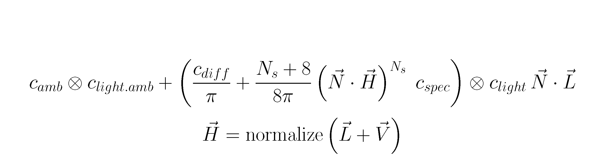

# Specular

In this assignment, you will add a specular component to the fragment shader. In addition to what was needed to
calculate the diffuse lighting, you will also need the _view vector_: this is a normalized vector from fragment to the
observer. This is very easy to calculate as the position of the observer (camera) is the origin of the coordinate
system (0,0,0).

1. Calculate the view vector in fragment shader. As the camera is at the origin of the view space, this is
   ```glsl
   vec3 view_dir = -normalize(vertex_position_vs);
   ```

2. Using the light vector and the view vector, calculate the half-vector. Use the normalized light direction `light_dir`
   from the previous assignment:
   ```glsl
   vec3 half_vector = normalize(light_dir + view_dir);
   ```

3. Calculate the specular component of the Blinn-Phong model according to the formula:

   <p align="center"></p>

   You will need the `Ks` and `Ns` parameters. `Ks` corresponds to c_spec in the formula and represents the
   specular color of the surface. `Ns` governs the _shininess_ of the surface. For now, set them to white (1.0,1.0,1.0)
   and 500.0 respectively "by hand" in the fragment shader.

   Note that, as in the formula, the specular term is multiplied by the same light color, intensity, attenuation and
   `N·L` factor as the diffuse term:
   ```glsl
   float specular = pow(max(dot(half_vector, normal), 0.0), Ns);
   frag_color += (Ns + 8.0) * INV_PI_8 * specular * Ks.rgb * light_energy;
   ```
   where `light_energy` is the light color multiplied by its intensity, attenuation and
   `max(dot(normal, light_dir), 0.0)`, i.e. everything that the diffuse term is multiplied by, apart from `color` and
   `INV_PI`, and `INV_PI_8` is a constant equal to 1/(8 pi).

4. Add the specular component to the fragment color in the fragment shader.

5. Add fields for `Ks` and `Ns` in the `BlinnPhongMaterial` class.

6. In the `BlinnPhongMaterial::create_from_mtl` factory method add code that will set those parameters from the
   description in the material files. `Ks` is called `specular` and `Ns` is called `shininess` in the `mtl_material_t`
   structure. Like `Kd` and `Ka`, the `Ks` color is in sRGB space, so convert it to linear space with
   `srgb_inverse_gamma_correction`.

7. Add those fields also to the `BlinnPhongMaterial` interface block in the fragment shader.

8. In the `bind` method of the `BlinnPhongMaterial` class, add code that will load values of those parameters in the
   corresponding uniform buffer. Remember to change the size of the buffer to `4*sizeof(glm::vec4)`, i.e. 64 bytes; this
   leaves room for the `illum` field added in the last step. For example, with `vec4 Ks` added after `Kd` and `float Ns`
   after `Ks`, the layout is: `Ka` at offset 0, `Kd` at 16, `Ks` at 32, `Ns` at 48, `use_vertex_colors` at 52 and
   `use_map_Kd` at 56. You can check the offsets using `uniform_info`.

9. Copy `square.mtl` and `square.obj` to `square_specular.mtl` and `square_specular.obj`. Change appropriate
   references in the `square_specular.obj` file. Change the name of OBJ file to `square_specular` in the `init` method
   of the `SimpleShapeApplication` class.

10. Add values of `Ks` and `Ns` parameters in the square material file `square_specular.mtl` and set the `illum`
    parameter to 2. Use the same values as in the fragment shader, `Ks 1.0 1.0 1.0` and `Ns 500`, so that you can check
    that nothing changes when you switch to the values from the uniform buffer in the next step.

11. In the fragment shader use those values from the uniform buffer instead of hand-coded values.

12. The `illum` parameter of the MTL file selects the illumination model: `illum 1` means ambient and diffuse lighting
    only, and `illum 2` adds the specular highlights. Both are handled by `BlinnPhongMaterial`, so the shader has to
    know which one to use. Add an `illum` field of type `int` to the `BlinnPhongMaterial` class and set it from
    `mat.illum` in `create_from_mtl`. Add a corresponding `int illum` field to the interface block (e.g. at offset 60,
    after `use_map_Kd`, which makes the block 64 bytes long), load it in the `bind` method, and in the fragment shader
    add the specular term only when `illum == 2`.
    Check it by setting `illum 1` in `square_specular.mtl`: the highlight should disappear.
