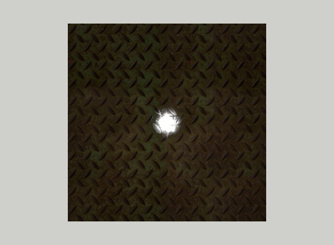

# Blinn-Phong textures

So far only the diffuse color `Kd` could be taken from a texture (`map_Kd`). In this assignment, we will do the same
for the remaining parameters of the Blinn-Phong material: the ambient color `Ka`, the specular color `Ks` and the
shininess `Ns`. In MTL files the corresponding textures are given by the `map_Ka`, `map_Ks` and `map_Ns` statements.
This way the surface can, e.g., be shiny in some places and dull in others.

Start by copying the `15_Specular` assignment to a new `15_z_BlinnPhong_textures` directory, as described in the
[Preparing the assignments](../README.md#preparing-the-assignments) section.

## The model

We will use the textures of a metal plate from the `Models/metal_plate/textures` directory. The `Models` directory
contains the model `square_textures.obj`, the same square as in `square_specular.obj`, with the material
`square_textures.mtl`:

```
newmtl MetalPlate
Ka 1.0 1.0 1.0
Kd 1.0 1.0 1.0
Ks 1.0 1.0 1.0
Ns 2000.0
map_Kd metal_plate/textures/metal_plate_diff_1k.png
map_Ka metal_plate/textures/metal_plate_diff_1k.png
map_Ks metal_plate/textures/metal_plate_spec_1k.png
map_Ns metal_plate/textures/ns0001.png
illum 2
```

The texture names are relative to the directory of the MTL file. Each texture is multiplied by the corresponding
parameter, so setting the colors to white means that the colors are taken from the textures only.

1. In the `init` method of `SimpleShapeApplication` load `square_textures.obj` instead of `square_specular.obj`.
   As `BlinnPhongMaterial` already handles `map_Kd`, you should see the plate, with the specular highlight of the
   previous assignment on top of it.

## Textures with any number of channels

The specular texture `metal_plate_spec_1k.png` and the shininess texture `ns0001.png` are grayscale images with only
one channel, while our `create_texture` function handles only images with three or four channels. The easiest way to
handle them is to ask `stbi_load` to convert the image to the number of channels we want: this is what its last
argument, `desired_channels`, is for. When it is zero, as so far, the image is loaded with its own number of channels.
A grayscale image converted to four channels has the gray value in the red, green and blue channels and an opaque alpha.

1. Add a third parameter to the `create_texture` function
   ```c++
   GLuint create_texture(const std::string &name, bool is_sRGB = true, int desired_channels = 0);
   ```
   and pass it to `stbi_load` as the last argument.

2. When `desired_channels` is not zero, `stbi_load` still returns the number of channels of the _file_ in its
   `channels` argument, but the data has `desired_channels` channels. So use `desired_channels`, when it is not
   zero, to choose the formats of `glTexImage2D`.

## Material

1. Add three fields of type `GLuint` to the `BlinnPhongMaterial` class: `map_Ka_`, `map_Ks_` and `map_Ns_`, all
   initialized to zero, with setters like `set_texture` for `map_Kd`.

2. In the `create_from_mtl` method load the textures, in the same way as the diffuse texture. In the
   `mtl_material_t` structure their names are `ambient_texname`, `specular_texname` and `specular_highlight_texname`
   (`map_Ns` is called the _specular highlight_ map). Load all three with four channels.

   Think about which of them are in the sRGB color space. The ambient and specular textures are colors, like the
   diffuse texture, so they are sRGB. The shininess texture is not a color, it contains numbers that multiply `Ns`, so
   it must not be converted: load it with `is_sRGB` set to `false`.

3. In the fragment shader add three samplers
   ```glsl
   uniform sampler2D map_Ka;
   uniform sampler2D map_Ks;
   uniform sampler2D map_Ns;
   ```
   Each sampler must be connected to a different texture unit. `map_Kd` uses unit 0, so use units 1, 2 and 3 for
   `map_Ks`, `map_Ns` and `map_Ka`. As for `map_Kd`, add static fields for the locations of these uniforms to the
   `BlinnPhongMaterial` class and set them in the `init` method using `glGetUniformLocation`.

4. In the `bind` method, for each of these textures that is present (handle greater than zero), assign its unit to
   the sampler with `glUniform1i`, activate the unit with `glActiveTexture(GL_TEXTURE0 + unit)` and bind the texture
   with `glBindTexture`. In the `unbind` method unbind each of them from its unit, and finish by activating unit 0
   again, so that the code that binds only `map_Kd` keeps working.

   Samplers are initialized to unit 0, so a forgotten `glUniform1i` makes the sampler read the diffuse texture,
   which is hard to notice. Check the locations: `glGetUniformLocation` returns -1 if the uniform is not used in the
   shader.

5. As with `use_map_Kd`, the shader has to know which textures are present. Add three `bool` fields `use_map_Ks`,
   `use_map_Ns` and `use_map_Ka` at the end of the `BlinnPhongMaterial` interface block, after `illum`. They are at
   offsets 64, 68 and 72, so increase the size of the buffer to `5*sizeof(glm::vec4)`, i.e. 80 bytes, and load them in
   the `bind` method. As before, you can check the offsets using `uniform_info`.

## Shader

Now use the textures in the fragment shader. Each texture multiplies the corresponding parameter:

1. The ambient color
   ```glsl
   vec3 ambient_color = Ka.rgb;
   if (use_map_Ka) {
       ambient_color *= texture(map_Ka, vertex_texcoord_0).rgb;
   }
   ```
   and use `ambient_color` instead of `Ka.rgb` when computing the ambient term.

2. In the same way compute `specular_color` from `Ks` and `map_Ks`, and use it instead of `Ks.rgb` in the specular
   term.

3. The shininess is a single number, so use only the red channel of the texture:
   ```glsl
   float shininess = Ns;
   if (use_map_Ns) {
       shininess *= texture(map_Ns, vertex_texcoord_0).r;
   }
   ```
   and use `shininess` instead of `Ns` in the specular term, also in the `(shininess + 8.0) * INV_PI_8`
   normalization factor.

The result should look like this:

<p align="center"></p>

The plate is dark, except for the highlight, which is no longer a smooth disk: its edge is broken up by the pattern of
the plate, because the shininess changes across the surface.

4. Check the effect of each texture by commenting out its line in `square_textures.mtl` (with `#`), one at a time.
   Without `map_Ns` the shininess is `Ns` = 2000 everywhere, so the highlight becomes a smaller, smooth disk. Without
   `map_Ks` the highlight becomes larger and brighter, because the specular texture makes the specular color darker
   than the white `Ks`.
