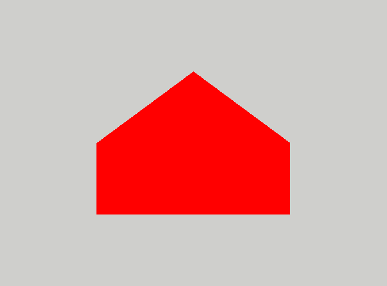

# House 
Termin oddania: 20.10.21 23:59 2pkt. 

1. Please copy the `src/Assignments/Triangle`  directory to  `src/Assignments/House`. You can do this either by provided script (use it at your own risk!):
    ```{python}
    python3 ./scripts/copy_assignment.py Triangle House
    ```
    or "by hand". For this purpose

   1. In the folder  `src/Assignments`  copy folders using 
      ```
      cp -r Triangle House
      ```
   2. Next switch to this newly created folder  and in file  `CMakeLists.txt`  change the name of the project to  `House`.


2. Rebuild everything by issuing command 
    ```
    cmake .. && make -j 4
    ```
    in `./build` directory. Or just use VS Code.  


3. If everything goes all right, then after executing the program
    ```
    ./buils/src/Assignments/House/House
    ```
    We should again see the red triangle. We are now ready to play with the code. 


4. Start by finding the place in `app.cpp` file where positions of vertices are stored. Change the location of the vertices.  What happens when one of the coordinates _x,y_ is outside the range [-1,1]? What if  _z_ coordinate is outside this range?
5. Add one more triangle. Rember to edit draw command in the `frame` function. 
6. Draw a  house 
 by adding beneath original triangle a rectangle of width 1.0 and height 0.5. This should be your final version that you should submit to repository.
  
    
  
    
    
