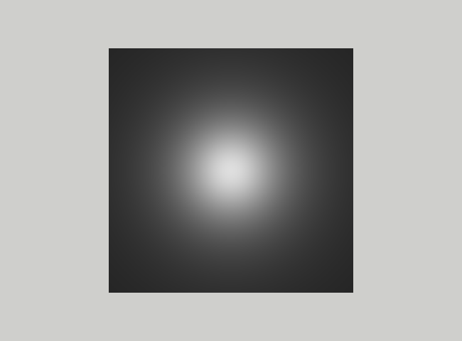

# Model oświetlenia Phonga — cześć dyfuzyjna

## Wstęp

W tym (ostatnim) ćwiczeniu zaimplementujemy model oświetlenia Phonga. Proszę zacząć jak zwykle do skopiowania zadania
Textures.

Jeśli po skopiowaniu wszystko działa, to proszę bazując na plikach `Models/pyramid.obj` i `Models/pyramid.mtl` oraz
na [opisie formatu OBJ](http://paulbourke.net/dataformats/obj/) stworzyć pliki `square.obj` i `square.mtl`, które razem
zaimplementują szary (Kd 0.25 0.25 0.25) kwadrat.
Kwadrat powinien leżeć w płaszczyźnie XY, środek kwadratu ma być w środku układu współrzędnych, a boki mają być
równoległe do osi X i Y i mają mieć długość dwa (2.0). W pliku `app.cpp` zamiast `pyramid.obj` lub `blue_marble.obj`
ładujemy plik `square.obj`. Kamerę proszę ustawić nad pionowo nad środkiem kwadratu. Jak pokaże się szary kwadrat, można
przejść dalej, ale wcześniej proszę wyłączyć funkcję pomijania tylnych ścianek (GL_CULL_FACE), ponieważ nasz kwadrat nie
jest bryłą
zamkniętą.

Teraz stworzymy nową klasę `PhongMaterial` poprzez stworzenie kopii plików `ColorMaterial.h` i `ColorMaterial.cpp`
nazywając je odpowiednio `PhongMaterial.h` i `PhongMaterial.cpp`. W tych plikach musimy zamienić wszystkie wystąpienia
nazwy `ColorMaterial` na `PhongMaterial`.

W pliku `Engine\mesh_loader.cpp` tworzymy nową funkcję `make_phong_material` poprzez "copy and paste" :(
funkcji `make_color_material` i zmieniając ją tak, aby zwracała `PhongMaterial`. W funkcji `load_mesh_from_obj` w tym
samym pliku dodajemy w switchu klauzulę

```c++
case 1:
    material = make_phong_material(mat, mtl_dir);
    break;
```

a w pliku `Models/square.mtl` dodajemy (lub zmieniamy z `ilum 0`) linijkę `illum 1`. I dalej wszystko powinno
działać :), ale w
metodzie `init` musimy dodać wywołanie funkcji `PhongMaterial::init`. Na koniec jeszcze kopiujemy pliki
szaderów `color_vs.glsl` i `color_fs.glsl` w katalogu `Engine/shaders` na pliki `phong_vs.glsl` i `phong_fs.glsl` w tym
samym katalogu. Następnie modyfikujemy metodę `PhongMaterial::init()` w ten sposób, aby kompilowała te shadery.

To niestety jest dopiero początek i mamy zaledwie podstawę, na której teraz możemy zacząć implementować model
oświetlenia:(

## Wektory normalne

Do oświetlenia, jak mam nadzieję, Państwo wiecie, potrzebne będą wektory normalne. Najpierw dodamy je do
pliku `square.obj`. Tak jak to tłumaczyłem, normalne, jak wszystko inne w OpenGL-u są atrybutami wierzchołków.  
Ponieważ powierzchnia kwadratu jest płaska, w każdym z wierzchołków będziemy mieli ten sam wektor normalny. Oznacza to,
że możemy zdefiniować go tylko raz poleceniem

```obj
vn <tu proszę wpisać odpowiednie współrzędne> 
```

Następnie w poleceniu `f` dodajemy indeks tego wektora (1) za parą ukośników

```obj
f 1//1 ... 
```

Polecenie `f` definiuje ściankę poprzez podanie indeksów jej wierzchołków. Dla każdego wierzchołka możemy podać trzy
indeksy oddzielone ukośnikami.
Pierwszy indeks wskazuje na współrzędne wierzchołka, drugi na współrzędne tekstury, a trzeci na wektor normalny. W tym
przypadku nie mamy współrzędnych tekstury i dlatego nie wpisujemy niczego pomiędzy dwoma ukośnikami. Proszę pamiętać, że
w przeciwieństwie do `c++` tu indeksy zaczynają się od jedynki. Cała ta operacja nie powinna w żadne sposób zmienić
działania programu.

Teraz musimy te wektory normalne przekazać do szadera fragmentów. Część po stronie CPU jest już zaimplementowana w
funkcji `load_mesh_from_obj`, a my musimy się zatroszczyć o "odebranie" ich po stronie GPU. W tym celu dodajemy w
shaderze wierzchołków linijkę

```glsl
layout(location=5) in vec3 a_vertex_normals;
```

oraz

```glsl
out vec3 vertex_normals_in_vs;
```

`vs` w nazwie zmiennej oznacza "view space" ponieważ docelowo będziemy chcieli przekształcić normalne do tej
przestrzeni.
Teraz w funkcji `main` w tym shaderze przypisujemy tej zmiennej wartość

```c
vertex_normals_in_vs = a_vertex_normals;
```

a shaderze fragmentów "odbieramy" tą zmienna poprzez deklarację

```glsl
in vec3 vertex_normals_in_vs;
```

Proszę pamiętać, że pomiędzy szaderami wierzchołków i fragmentów następuje _interpolacja_ atrybutów (tu normalnych).
Oznacza to, że przed użyciem ich powinniśmy te wektory na nowo znormalizować dodając w funkcji `main` szadera
fragmentów linijkę

```glsl
vec3 normal = normalize(vertex_normals_in_vs);
```

Żeby przetestować czy wszystko działa dodajemy na końcu funkcji `main` szadera fragmentów linijkę

```c
 vFragColor.rgb = normal;
}
```

W ten sposób traktujemy normalne jak kolor. Jaki kolor powinien pojawić się na ekranie? Jeśli pojawi nam się dobry
kolor, to przechodzimy do kolejnej części, nie zapominając o usunięciu powyższej linijki.

## Współrzędne wierzchołków

Kolejną rzeczą, której potrzebujemy w szaderze fragmentów, są współrzędne wierzchołków. Ponieważ te współrzędne są już
przekazane do szadera wierzchołków, musimy tylko zadbać o przesłanie ich dalej. W tym celu dodajemy do szadera
wierzchołków deklarację:

```glsl
out vec3 vertex_coords_in_vs;
```

i w funkcji `main` przypisujemy im odpowiednią wartość.

W szaderze fragmentów deklarujemy odpowiadającą zmienną typu `in`. Na koniec znów wyświetlimy te współrzędne na ekranie,
ale ponieważ one przybierają wartości od w przedziale [-1,1] to weźmiemy wartość bezwzględną

```glsl
vFragColor = abs(vertex_coords_in_vs);
```

Jeśli na ekranie pojawią się kolory, których się spodziewaliśmy, to idziemy dalej.

## Transformacje

Ja na razie współrzędne wierzchołków i normalne pozostają nadal w przestrzeni obiektu. Musimy przekształcić je do
przestrzeni widoku (view space). W tym celu musimy rozszerzyć bufor uniform `Transformations` zawierający macierz `PVM`
o dodatkowe dwie macierze. Jedna to macierz 4x4  `VM` służąca do transformowania obiektu do przestrzeni widoku, a druga
to macierz 3x3 `N` służąca do transformacji normalnych. Należy dopisać te macierze do definicji bufora w szaderze
wierzchołków.

Następnie proszę przydzielić temu buforowi więcej pamięci w funkcji `init`. Proszę pamiętać, że zgodnie ze
standardem `std140` macierz 3x3 jest przechowywana jako 3 wektory (kolumny) o długości 4.

W metodzie `frame` tworzymy te macierze i przesyłamy je do szaderów. Macierz `N` tworzymy poleceniami

```c++
auto R = glm::mat3(VM);
auto N = glm::mat3(glm::cross(R[1], R[2]), glm::cross(R[2], R[0]), glm::cross(R[0], R[1]));
```

Przesyłając tę macierz musimy pamiętać o standardzie `std140`. Każdą kolumną musimy przesłać osobno, ponieważ, pomimo że
posiadają one po trzy elementy typu `float`, muszą być przesunięte o cztery takie elementy. Jeśli macierz `N` wygląda
następująco

```text
N = [00 01 02
     10 11 12
     20 21 22]
```

to w buforze musi wyglądać tak:

```text
[00 10 20 _ 01 11 21 _ 02 12 22]
```

Należy skorzystać z tego, że `N[k]` jest k-tą kolumną macierzy `N`.

W szaderze wierzchołków przemnażamy współrzędne punktów i normalne przez odpowiednie macierze, przy czym normalne należy
po tej transformacji znormalizować za pomocą funkcji `normalize`. Znowu warto "wypisać" na ekran wektory normalne oraz
współrzędne fragmentów. Tym razem kolory powinny się zmieniać podczas obracania kamery.

## Światła

Ostatnim elementem, jakiego potrzebujemy to światła. Światła będą miały położenie ustalone w przestrzeni świata i będą
transformowane do przestrzeni widoku przed przesłaniem ich na GPU. Zaimplementujemy wyłącznie światło punktowe. W tym
celu w
katalogu `Engine` dodajemy plik `Light.h` z definicją klasy `PointLight`

```c++
namespace xe {
    struct PointLight {
        PointLight() = default;
        PointLight(const glm::vec3 &pos, const glm::vec3 &color, float intensity, float radius)
                : position_in_ws(pos),
                  color(color), intensity(intensity), radius(radius) {}

        alignas(16) glm::vec3 position_in_ws;
        alignas(16) glm::vec3 position_in_vs;
        float radius;
        alignas(16) glm::vec3 color;
        float intensity;
      
    };
}
```

Polecenia `alignas` ustawiają nam elementy struktury w taki sposób, że spełniony jest standard `std140` i będziemy mogli
wysłać całą strukturę, bez pola `position_in_ws`, jednym poleceniem do bufora uniform. Do klasy `SimpleShapeApplication`
dodajemy pola:

```c++
glm::vec3 ambient_;
std::vector<xe::PointLight> p_lights_;
```

i metody:

```c++
void add_light(const xe::PointLight &p_light) {
    p_lights_.push_back(p_light); 
}

void add_ambient(glm::vec3 ambient) {
            ambient_ = ambient;
}
```

W metodzie `init` dodajemy jedno światło w odległości jeden dokładnie nad środkiem kwadratu, czyli we współrzędnych (
0,0,1).

Teraz do szadera fragmentów dodajemy bufor świateł:

```glsl
const int MAX_POINT_LIGHTS=24;

struct PointLight {
    vec3 position_in_view_space;
    float radius;
    vec3 color;
    float intensity;
};

layout(std140, binding=2) uniform Lights {
    vec3 ambient;
    uint n_p_lights;
    PointLight p_light[MAX_POINT_LIGHTS];
};
```

A po stronie CPU w klasie `SimpleShapeApplication` tworzymy odpowiadający mu bufor i alokujemy dla niego pamięć w
metodzie `init`. Należy pamiętać, że struktury są ustawiane zgodnie ze swoim największym elementem, czyli w tym
przypadku początek wektora p_light musi wypaść na wielokrotność 16 bajtów. Nazwa bufora powinna być polem klasy,
ponieważ musi
być dostępna również w metodzie `frame`.

W metodzie `frame` transformujemy każde światło do przestrzeni widoku i ładujemy je do bufora światła, pamiętając o
odpowiednim ustawieniu w pamięci. Ładujemy też liczbę świateł `n_p_lights` (równą jeden) oraz światło `ambient`. W
szaderze fragmentów
zaczniemy od przypisania jako koloru iloczyny kolory powierzchni `Kd` i światła `ambient`.

```glsl
vFragColor.a = Kd.a;
vFragColor.rgb = Kd.rgb*ambient;
```

Najlepiej teraz nadać jakiś intensywny kolor światłu ambient, wtedy łatwo zauważyć efekt na ekranie. Jak ambient działa
możemy teraz zrobić to samo z kolorem naszego jednego światła punktowego.

## Światło rozproszone (diffuse)

Jeśli to działa, to implementujemy cześć dyfuzyjną modelu Phonga. Mamy już w szaderze wszystkie potrzebne składniki.
Światła będziemy przetwarzali w pętli, pamiętając, że wpływ każdego światła dodaje się do następnych. Żeby sprawdzić
poprawność, należy światło przybliżyć
do kwadratu. Obszar objęty światłem powinien się zmniejszyć. Do obliczenia iloczynu skalarnego dwu wektorów służy
funkcja `dot`. Proszę pamiętać o tym, że jeśli ten iloczyn jest ujemny to oznacza, że ten fragment powierzchni nie jest
oświetlony tym świtałem.
Na koniec dodajemy zależność natężenia światła od odległości od źródła. Zależność ta ma postać

```text
1/pow( max(distance, radius), 2.0);
```

gdzie `distance` to odległość światła od oświetlanego punktu powierzchni, a `radius` to atrybut danego świtała, który
możemy w przybliżeniu traktować jak rozmiar danego światła. Długość wektora, której potrzebujemy do obliczenia

Tak wygląda rezultat dla światła 

```c++
xe::PointLight{{0.0, 0.0, 1.0}, {1.0, 1.0, 1.0}, 2.0, 0.1};
```




